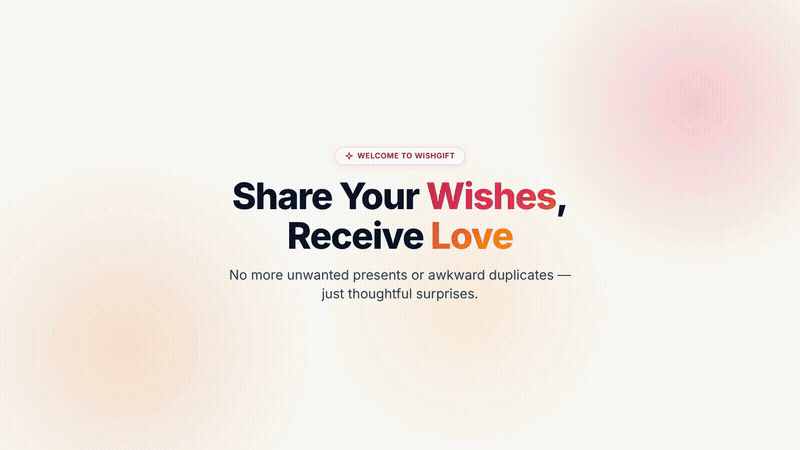

# WishGift

WishGift is a full-stack web application for creating, managing, and sharing wishlists. Users can curate gift ideas, coordinate reservations in secret to prevent duplicate gifting, manage follower permissions, and share lists securely.

---

## Launch Preview

[](brag-output/brag.mp4)

*Autoplaying launch preview. Click the preview above to view the full 1080p video with audio ([`brag-output/brag.mp4`](brag-output/brag.mp4)).*

---

## Key Features

- **Wishlist Management**: Create and organize custom wishlists by occasion (birthdays, holidays, weddings) with customizable visibility.
- **Gift Item Curation**: Add items with images, multi-currency pricing, priority levels (High, Medium, Low), and direct merchant links.
- **Secret Reservations**: Friends can reserve items on public wishlists. The reservation is visible to other friends to prevent duplicate gifts, while remaining hidden from the recipient.
- **Privacy and Follower Controls**: Two-step follow approval workflow (`PENDING` -> `ACCEPTED` / `REJECTED`). Only accepted followers can view public wishlists.
- **Flexible Authentication**: Sign in using either an email address or username, powered by NextAuth.js and bcrypt password hashing.

---

## Tech Stack

| Layer | Technologies |
| :--- | :--- |
| **Framework** | Next.js 16 (App Router), React 19, TypeScript |
| **Styling** | Tailwind CSS v4, tw-animate-css |
| **UI Components** | Radix UI primitives, Lucide Icons, Framer Motion |
| **State & Data** | Zustand, TanStack React Query |
| **Authentication** | NextAuth.js (JWT credentials strategy, bcryptjs) |
| **Database & ORM** | SQLite (local) / Turso LibSQL (production), Prisma ORM |
| **Validation** | Zod, React Hook Form |

---

## Architecture Overview

```text
[ Client Browser ]
       │
       ▼
[ Next.js 16 App Router (React 19, Tailwind CSS v4, Zustand) ]
       │
       ▼
[ Next.js API Routes (Zod Validation & Authorization Checks) ]
       │
       ├── NextAuth.js (JWT Session Strategy: Email or Username)
       │
       ▼
[ Data Access Layer (Prisma ORM & LibSQL Client) ]
       │
       ▼
[ SQLite / Turso LibSQL Database ]
```

### Core Workflows

1. **Authentication**: Users authenticate via email or username. Passwords are encrypted with `bcryptjs`, and sessions are maintained using JWTs.
2. **Follow System**: Following requires recipient approval. Once accepted, followers gain access to the user's public wishlists.
3. **Gift Reservations**: When an accepted follower reserves an item, the reservation status is recorded to notify other followers while keeping the recipient in surprise.

---

## Getting Started

### Prerequisites

- Node.js 18.x, 20.x, or newer
- npm 9.x or newer

### Installation

1. Clone the repository:
   ```bash
   git clone https://github.com/your-username/wishgift.git
   cd wishgift
   ```

2. Install dependencies:
   ```bash
   npm install
   ```

3. Configure environment variables:
   ```bash
   cp .env.example .env
   ```
   Ensure `.env` contains the required settings:
   ```env
   DATABASE_URL="file:../db/custom.db"
   NEXTAUTH_SECRET="your-development-secret-key"
   NEXTAUTH_URL="http://localhost:3000"
   ```

4. Initialize the database:
   ```bash
   # Generate Prisma Client types
   npm run db:generate

   # Push schema to local SQLite database
   npm run db:push

   # Apply column migrations
   node scripts/migrate-all-dbs.mjs
   ```

5. Start the development server:
   ```bash
   npm run dev
   ```
   Open `http://localhost:3000` in your browser.

---

## Production Build

To build and test the production application locally:

```bash
# Build the production bundle
npm run build

# Start the production server
npm run start
```

---

## Project Structure

```text
wishgift/
├── brag-output/                # Launch video, poster, and brief
│   ├── brag.mp4                # 18-second launch brag video
│   ├── brag.gif                # Autoplaying launch preview
│   ├── brag.jpg                # Video poster frame
│   ├── brag-plan.md            # Video storyboard and audio plan
│   └── share-copy.txt          # Social media copy
├── db/                         # Local SQLite database files
├── prisma/                     # Prisma schema definitions
│   └── schema.prisma
├── public/                     # Static assets
├── scripts/                    # Database migration and maintenance scripts
│   └── migrate-all-dbs.mjs
├── src/
│   ├── app/                    # Next.js App Router routes and API endpoints
│   │   ├── api/                # REST endpoints (auth, follow, wishlists, gifts)
│   │   ├── layout.tsx          # Root layout with providers
│   │   └── page.tsx            # Main app shell and routing
│   ├── components/             # Reusable UI primitives and view modules
│   │   ├── app/                # Feature views (Landing, Wishlists, Profile)
│   │   └── ui/                 # Primitives (Button, Dialog, Card, etc.)
│   ├── hooks/                  # Custom React hooks
│   ├── lib/                    # Utilities, Prisma client, NextAuth options
│   └── store/                  # Zustand state stores
├── package.json
└── tsconfig.json
```

---

## API Reference

| Method | Endpoint | Description | Access |
| :--- | :--- | :--- | :--- |
| `POST` | `/api/auth/register` | Register a new user account | Public |
| `POST` | `/api/auth/[...nextauth]` | Authenticate using email or username | Public |
| `GET` | `/api/users` | Search users by name or username | Authenticated |
| `GET` | `/api/users/[username]` | Retrieve user profile details | Authenticated |
| `GET` | `/api/follow` | List users currently followed | Authenticated |
| `POST` | `/api/follow` | Send a follow request (`PENDING`) | Authenticated |
| `DELETE` | `/api/follow` | Cancel a follow request or unfollow | Authenticated |
| `GET` | `/api/follow/requests` | List incoming pending follow requests | Authenticated |
| `POST` | `/api/follow/requests` | Accept or reject a follow request | Authenticated |
| `GET` | `/api/wishlists` | List wishlists accessible to the user | Authenticated |
| `POST` | `/api/wishlists` | Create a new wishlist | Authenticated |
| `GET` | `/api/wishlists/[id]` | Fetch wishlist details (follower restricted) | Authenticated |
| `POST` | `/api/gifts/reserve` | Reserve an item on a public wishlist | Accepted Followers |

---

## Available Commands

| Command | Description |
| :--- | :--- |
| `npm run dev` | Start local development server on port 3000 |
| `npm run build` | Generate Prisma client and compile Next.js production build |
| `npm run start` | Start production server |
| `npm run lint` | Run ESLint checks |
| `npm run db:generate` | Generate Prisma Client types |
| `npm run db:push` | Push schema changes directly to SQLite database |
| `npm run db:migrate` | Run Prisma migrations for development |
| `npm run db:reset` | Reset database and re-apply migrations |

---

## Deployment

### Deploying to Vercel

1. Push your repository to GitHub.
2. Import the project into Vercel.
3. Add the following Environment Variables in the Vercel project settings:
   - `DATABASE_URL`: Hosted LibSQL/Turso connection URL.
   - `NEXTAUTH_SECRET`: Random secure secret key.
   - `NEXTAUTH_URL`: Canonical production URL (e.g., `https://your-domain.vercel.app`).
4. Trigger the deployment.

---

## License

This project is licensed under the MIT License.
